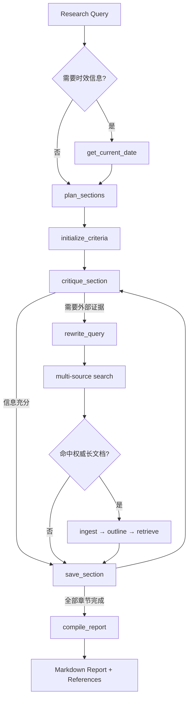

# Deep Research Agent

一个面向陌生领域调研与时效性问题的研究 Agent。系统通过规划、跨源检索、章节级反思、按需文档精读和引用映射，生成结构化 Markdown 报告。

> 本仓库是无运行历史的公开候选版本。真实查询、模型对话、搜索响应、报告、Cookie 和 API Key 均不会进入版本控制。

## 设计重点

- **Planning + Reflection**：为研究问题规划章节和评价标准，逐章节识别证据缺口并定向补搜。
- **Agentic tool loop**：模型通过 Function Calling 自主选择规划、查询改写、搜索、文档摄入、检索、保存与编译工具，而不是执行固定流水线。
- **跨源检索**：以 Tavily 为主源，可选接入 arXiv、Google Scholar、GitHub 及社区来源；按来源配置限速、并发与熔断。
- **文档精读**：将候选 HTML/PDF 落盘分块，通过轻量 BM25 风格评分在文档内部检索；正文不直接塞入长期对话上下文。
- **上下文治理**：模型消息、章节状态和外部材料分离，搜索结果与文档保存在运行目录，工具结果只返回紧凑摘要。
- **引用溯源**：正文使用编号引用，报告末尾生成 URL 映射，便于评测和人工核查。
- **错误恢复**：统一错误分类、按源限流、重试与熔断；运行轨迹和阶段结果可持久化。

## 工作流



每个章节独立维护初稿、已用来源、待整合来源、评审结果和状态。`critique_section` 是信息是否充分的决策门；文档中已有答案时优先 `retrieve`，否则执行定向搜索。

### 上下文与状态分层

| 层 | 保存内容 | 目的 |
| --- | --- | --- |
| Messages | 用户问题、Agent 决策、紧凑工具结果 | 保持模型交互连续性 |
| Section State | criteria、draft、来源 ID、review、final、status | 让各章节独立迭代与并行推进 |
| External Materials | 搜索原文、文档分块、报告和 trace | 避免大文本长期占用上下文 |

宽泛搜索采用两阶段锁：同一轮可以并行发出一批查询，下一轮才提升为永久锁；后续章节只做定向补搜，避免重复扩大检索范围。

## 可靠性机制

| 机制 | 行为 |
| --- | --- |
| 分级错误 | 区分可重试基础设施错误、Agent 决策错误与致命认证错误 |
| API 重试 | 连接、429 和 5xx 使用指数退避；SDK 超时会主动取消请求 |
| max_tokens 恢复 | 主循环保留已完成工具结果并提示模型续写，限制恢复次数 |
| 来源限流 | 按搜索源配置并发、请求间隔、QPH 与熔断时间 |
| 全局 LLM 信号量 | 主 Agent 与子工具共享并发上限 |
| Trace 持久化 | 每轮决策、工具调用、错误和阶段结果持续落盘 |

## 目录结构

```text
agent.py               主 Agent loop、工具调度与运行轨迹
config.py              模型、搜索源、限流和文档检索配置
context/system_prompt.py
tools/
  registry.py          工具注册、共享状态与引用编号
  planner.py           章节规划
  query_rewriter.py     面向来源的查询改写
  search.py             多源搜索与候选文档识别
  document.py           HTML/PDF 摄入、分块、大纲与检索
  reflect.py            章节质量评审
  report.py             章节保存与报告编译
  rate_limiter.py       分级限流与熔断
tests/                  离线单元测试
scripts/                Benchmark、轨迹检查与在线探测脚本
```

## 快速开始

要求 Python 3.11+。

```bash
python -m venv .venv
# Windows: .venv\Scripts\activate
# macOS/Linux: source .venv/bin/activate
pip install -r requirements.txt

# Windows PowerShell
Copy-Item .env.example .env
# macOS/Linux: cp .env.example .env
```

至少配置以下变量：

```dotenv
ANTHROPIC_BASE_URL=https://your-llm-endpoint.example
API_KEY=your-api-key
MODEL=your-model-name
TAVILY_API_KEY=your-tavily-key
```

运行：

```bash
python main.py "调研一个需要多源证据的问题"
```

生成内容默认写入 `traces/<query>_<timestamp>/`，其中包括报告、搜索结果、文档块、错误日志和完整 Agent 轨迹。该目录可能包含敏感查询或第三方材料，已被 `.gitignore` 排除。

## 可选数据源

- Tavily：配置 `TAVILY_API_KEY`。
- arXiv：无需密钥，但遵循独立的低频限速。
- Google Scholar：无需独立 API Key，但可用性取决于本机检索后端。
- GitHub：使用已登录的 `gh` CLI，可通过 `GH_BIN` 指定可执行文件。
- 社区来源：部分实现依赖本机已有的浏览器登录态或外部 CLI；默认不保证可用，请遵守对应网站条款与访问频率限制。

当前注册的来源为 Tavily、小红书、知乎、微信、微博、GitHub、arXiv 和 Google Scholar。代码中保留了未启用的 Semantic Scholar 适配器，但它不在默认工具注册表中。

## 运行产物

| 路径 | 内容 |
| --- | --- |
| `run.log` | 终端输出镜像 |
| `trace.json` | 完整 messages、tool use 与 tool result |
| `search_results/` | 每次搜索的结构化原始结果 |
| `documents/<doc_id>/` | 摄入文档的元数据、正文分块与大纲 |
| `sections_checkpoint.json` | 章节标准、状态、草稿与正文快照 |
| `errors.jsonl` | 分类后的结构化错误日志 |
| `report_*.md` | 最终报告及编号参考文献表 |

这些文件用于恢复、诊断和评测，但可能包含敏感查询或第三方材料，因此只在运行时生成并被版本控制排除。

## 测试

```bash
pip install -r requirements-dev.txt
python -m compileall -q agent.py config.py context tools tests
pytest -q
```

`scripts/streaming_probe.py` 与 `scripts/rewrite_eval.py` 是需要真实模型凭证的手动探测/评测脚本，不属于默认离线测试。

## DeepResearch Bench

评测脚本不会内置 benchmark 路径。先单独获取 DeepResearch Bench，然后设置：

```bash
export DEEP_RESEARCH_BENCH_DIR=/path/to/deep_research_bench
```

Windows PowerShell：

```powershell
$env:DEEP_RESEARCH_BENCH_DIR = "C:\path\to\deep_research_bench"
```

随后可使用 `scripts/eval_md.py`、`scripts/fact_runner.py` 或 `scripts/run_all.py`。脚本会从环境变量读取凭证，不会读取或写入仓库内的密钥。

- `eval_md.py` / `run_all.py`：用 RACE 维度评估报告的完整性、洞察、指令遵循与可读性。
- `fact_runner.py`：抽取正文引用，抓取来源并核验 statement–URL 一致性，用于评估引用可验证性。

## 安全与数据边界

- 不要提交 `.env`、`traces/`、报告、Cookie 或抓取后的网页/PDF。
- 运行目录可能包含完整用户问题、模型响应与第三方网页内容，分享前必须人工审查。
- 社区来源的抓取和浏览器态复用可能受平台条款约束，公开部署前应按目标环境重新评估。
- 当前实现面向单机研究与实验，不提供多租户鉴权或沙箱隔离。

## License

尚未指定开源许可证。在仓库所有者选择许可证前，默认保留全部权利。
